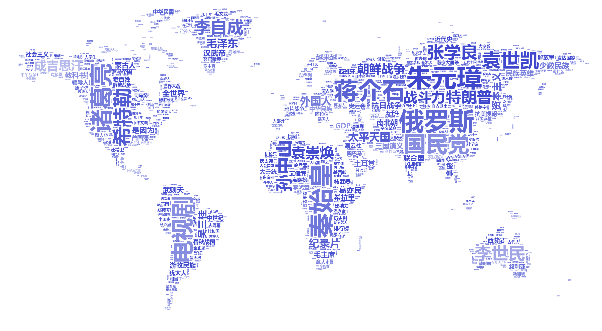

# ConicWare-Community_Data_Analyzer

### this project has been decreapteed and will not be updated in future for realated work refer to [here](https://github.com/sxysun/TieCloud-Search)

### 1. INTRODUCTION

#### Mining and analyze data from Tieba, largest online community in China (Chinese reddit), this is a project including *data capturing, natural language processing* and *data visualization*.

A project derived from the `ConicWare` project, more information about it or my other projects can be found on http://caudep.com/. 

### 2. PREVIEW
To view the output of this program, find the folder called `/Sample`
the result from the history forum in Tieba:

*though the program has changed much and data would be focused on a micro perspective, the effect of output images is alike*

### 3. OTHER NOTES
This project is mostly written in java, with a few bash and python. The project is tested to be running well on ***NIX** machines.
#### (Windows users can refer to point 3 in IMPORTANT NOTES & WARNING)

The GUI is really shabby and I know it. For other reference to sample output(text ones rather than images) check `/dataAnalyzer`. (in it are pre-analyzed data and output text file for the *Lovelive!* community 

### 4. IMPORTANT NOTES & WARNING:

1. The jar file provided is NOT the isolated community data analyzer but the ConicWare project including much more functionality, but of course you can open it and find the analyzer panel. 

2. One thing to be notified is that the ConicWare project has **DRM** codes preventing you from copying and running it on an unauthorized computer, so do NOT just open the jar file. You should either 1.open the registration panel and contact me through email for a registration code, or 2.open the whole project folder, find and delete the **DRM** codes, then run the program. (and of course another way is to find the `ConicWareTool.jar` file in the `/res` folder and registrate on your own).

3. Running this program in Windows machines may have encoding problems!!! but as long as you are analyzing data of a fully english community, you are fine. The reason has not been found, not the path seperation problem and the encoding HAS been set to uniform **UTF-8**(though i am thinking if GBK would tackle the problem as my linux mint computer uses it).

4. Each time the program opens, it will connect to my server and update the /res folder, so if you feel it is dragging the spped, delete related code.

5. The `.conf` and `.caudep` files in the `/res` folder has been encrypted and you can decrypt them using the `ConicWareTool.jar`, code is 3 or 5.
